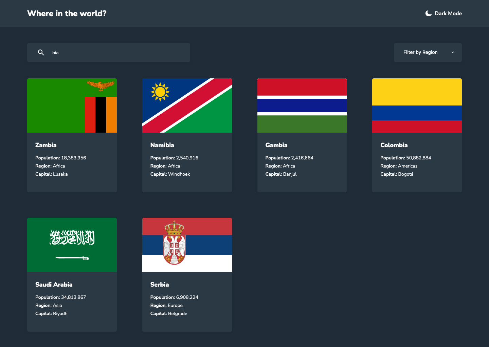

# Frontend Mentor - REST Countries API with color theme switcher solution

This is a solution to the [REST Countries API with color theme switcher challenge on Frontend Mentor](https://www.frontendmentor.io/challenges/rest-countries-api-with-color-theme-switcher-5cacc469fec04111f7b848ca). Frontend Mentor challenges help you improve your coding skills by building realistic projects.

## Table of contents

- [Overview](#overview)
  - [The challenge](#the-challenge)
  - [Screenshot](#screenshot)
  - [Links](#links)
- [My process](#my-process)
  - [Built with](#built-with)
  - [Useful resources](#useful-resources)
- [Author](#author)

**Note: Delete this note and update the table of contents based on what sections you keep.**

## Overview

### The challenge

Users should be able to:

- See all countries from the API on the homepage
- Search for a country using an `input` field
- Filter countries by region
- Click on a country to see more detailed information on a separate page
- Click through to the border countries on the detail page
- Toggle the color scheme between light and dark mode _(optional)_

### Screenshot

### Links

- Solution URL: [https://www.frontendmentor.io/solutions/mobile-first-rest-countries-api-ezTZpD1ND](https://www.frontendmentor.io/solutions/mobile-first-rest-countries-api-ezTZpD1ND)
- Live Site URL: [https://nakoyawilson-rest-countries-api.netlify.app/](https://nakoyawilson-rest-countries-api.netlify.app/)

## My process

### Built with

- Semantic HTML5 markup
- CSS custom properties
- Mobile-first workflow
- Figma file
- [React](https://reactjs.org/)
- [React Router](https://reactrouter.com/)
- [axios](https://axios-http.com/)

### Useful resources

- [How to Pass Props Through React Router's Link Component](https://ui.dev/react-router-pass-props-to-link)
- [How to print a number with commas as thousands separators in JavaScript - Stack Overflow](https://stackoverflow.com/questions/2901102/how-to-print-a-number-with-commas-as-thousands-separators-in-javascript) -[How to display object's keys and values in react component [duplicate] - Stack Overflow](https://stackoverflow.com/questions/57581147/how-to-display-objects-keys-and-values-in-react-component)
- [getting the last item in a javascript object - Stack Overflow](https://stackoverflow.com/questions/4317456/getting-the-last-item-in-a-javascript-object)
- [ReactJS Tutorial on Creating a Custom Select/Dropdown](https://andela.com/insights/react-js-tutorial-on-creating-a-custom-select-dropdown/)

## Author

- Website - [Nakoya Wilson](https://nakoyawilson.netlify.app/)
- Frontend Mentor - [@nakoyawilson](https://www.frontendmentor.io/profile/nakoyawilson)
- Twitter - [@nakoyawilson](https://twitter.com/nakoyawilson)
- LinkedIn - [@nakoyawilson](https://www.linkedin.com/in/nakoyawilson/)
